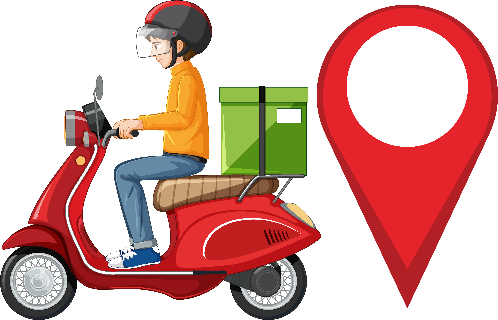

<div id="top"></div>

<div align="center">
  
  [![MIT License][license-shield]][license-url]
  [![LinkedIn][linkedin-shield]][linkedin-url]
  
</div>

<br />
<div align="center">
  <a href="https://github.com/MrProscrite/Simulador_Entrega">
    
  </a>
  
  <div style="display: inline_block" align="center">
    
    
    
  </div>

<h3 align="center">Simulador de Posições</h3>

  <p align="center">
    Uma aplicação que simula percursos de 3 entregadores.
    <br />
    <a href="https://github.com/github_username/repo_name"><strong>Veja as demais aplicações »</strong></a>
</div>

<details>
  <summary>Tabela de Conteúdos</summary>
  <ol>
    <li>
      <a href="#sobre-o-projeto">Sobre o Projeto</a>
      <ul>
        <li><a href="#tecnologias-utilizadas">Tecnologias utilizadas</a></li>
      </ul>
    </li>
    <li>
      <a href="#getting-started">Getting Started</a>
      <ul>
        <li><a href="#pré-requisitos">Pré-requisitos</a></li>
        <li><a href="#instalação">Instalação</a></li>
      </ul>
    </li>
    <li><a href="#uso">Uso</a></li>
       <ul>
        <li><a href="#exemplos-de-entregadores">Exemplos de Entregadores</a></li>
      </ul>
    <li><a href="#por-que-utilizar-o-apache-kafka">Por que utilizar o Apache Kafka</a></li>
    <li><a href="#license">License</a></li>
    <li><a href="#contato">Contato</a></li>
  </ol>
</details>

<p align="right">(<a href="#top">back to top</a>)</p>

## Sobre o projeto

[![Simulador de posições][app-screenshot]](https://github.com/MrProscrite/Simulador_Entrega)

Esta aplicação é apenas uma parte, um microserviço, de um projeto que visa mostrar ao usuário final a exata localização do entregador e seu percurso restante.

A aplicação é dividida em três partes:
* Aplicação
* Kfaka Producer
* Kafka Consumer

A aplicação recebe as mensagens do Producer, que é quem diz qual entregador vai ser utilizado, e passa a rota para o Consumer que começa a percorrer por todo o trajeto a cada 500 ms.

<p align="right">(<a href="#top">back to top</a>)</p>

## Tecnologias utilizadas

* [Golang](https://go.dev/)
* [Kafka](https://kafka.apache.org/)
* [Docker](https://www.docker.com/)

<p align="right">(<a href="#top">back to top</a>)</p>

## Getting Started

### Pré-requisitos
* Golang
* Docker

### Instalação

1. Clone o repositório
   ```sh
   git clone https://github.com/MrProscrite/Simulador_Entrega.git
   ```
2. Execute o Docker Compose da aplicação
   ```sh
   docker-compose -up -d
   ```
3. Vá até o diretório do Docker do Kafka inicie o Docker Compose
   ```sh
   cd .docker/kafka
   docker-compose -up -d
   ```

## Uso

O ideal é ter três consoles (como na imagem na aba sobre), um para cada parte do projeto. 

No console da aplicação vamos iniciar o docker da Aplicação:
   ```sh
   docker exec -it simulator bash
   ```
Nos outros dois consoles, vamos iniciar o docker do Kafka:
   ```sh
   docker exec -it kafka-kafka-1 bash
   ```
No primeiro console do Kafka, chamaremos de Producer e daremos o seguinte código:
   ```sh
   kafka-console-producer --bootstrap-server=localhost:9092 --topic=route.new-direction
   ```
No segundo console do Kafka, chamaremos de Consumer e daremos o seguinte código:
   ```sh
   kafka-console-consumer --bootstrap-server=localhost:9092 --topic=route.new-position --group=terminal
   ```

Pronto, agora é so enviar um dos três json de exemplo no console do Kafka Producer e ver a mágica acontecer. Você verá que a mensagem aparecerá no console da Aplicação e logo após o Kafka Consumer enviará as posições do entregador escolhido.

### Exemplos de Entregadores:

```
{"clientId":"1","routeId":"1"}
```
```
{"clientId":"2","routeId":"2"}
```
```
{"clientId":"3","routeId":"3"}
```

## Por que utilizar o Apache Kafka

- Event-driven
  - Carros
  - E-commerce
  - Alarmes
  - Monitoramento
  - Microsserviços
- Tempo real
- Histórico dos dados
- Características
  - Plataforma
  - Trabalha de forma distribuída
  - Utiliza o disco ao invés de memória para processar os dados
- Kafka Cluster

<p align="right">(<a href="#top">back to top</a>)</p>

## LICENSE

Distributed under the MIT License. See `LICENSE` for more information.

<p align="right">(<a href="#top">back to top</a>)</p>

## Contato

Lucas Ramos - [@Proscrite1v9](https://twitter.com/twitter_handle) - lucas-ramos8@hotmail.com

Project Link: [https://github.com/MrProscrite/Simulador_Entrega](https://github.com/MrProscrite/Simulador_Entrega)

<p align="right">(<a href="#top">back to top</a>)</p>


[license-shield]: https://img.shields.io/github/license/othneildrew/Best-README-Template.svg?style=for-the-badge
[license-url]: https://github.com/MrProscrite/Simulador_Entrega/blob/main/LICENSE
[linkedin-shield]: https://img.shields.io/badge/-LinkedIn-black.svg?style=for-the-badge&logo=linkedin&colorB=555
[linkedin-url]: https://linkedin.com/in/lucasramosdev
[app-screenshot]: .images/screenshot.png

